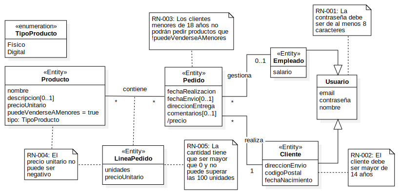

# Laboratorio 2 - Creación de tablas I y II

En estas dos sesiones de laboratorio se cubrirá lo siguiente:

**Primera sesión**
- Creación de una nueva Base de Datos
- Creación de tablas de ejemplo

**Segunda sesión**
- Ejercicio: Sistema de información para gestor de citas (segunda sesión)


## Creación de nueva Base de Datos

Conectese al SGBD MariaDB con el cliente HeidiSQL (u otro a su elección) con el usuario `iissi_root`, cree una nueva base de datos llamada `tiendaOnline` y de permisos de administración al usuario `iissi_user` de esa base de datos recién creada.

Puede consultar las acciones para realizar estas operaciones en el laboratorio 1.

## Creación de tablas de ejemplo

La base de datos `tiendaOnline` incluye una versión minimalista para soportar la compra y venta de productos de una tienda online genérica. Se propone el siguiente modelo conceptual:


El modelo conceptual anterior se ha transformado en el siguiente modelo relacional:

```Javascript
Usuario(!id, #email, contraseña, nombre)
Empleado(!id, @usuarioId, salario)
Cliente(!id, @usuarioId, direccionEnvio, codigoPostal, fechaNacimiento)
Pedido(!id, @clienteId, @empleadoId, fechaRealizacion, fechaEnvio, direccionEntrega, comentarios)
LineaPedido(!id, #(@pedidoId, @productoId), unidades, precioUnitario)
Producto(!id, nombre, descripción, precioUnitario, @tipoProductoId, puedeVenderseAMenores)
TipoProducto(!id, nombre)
```

y las siguientes restricciones en lenguaje natural:

1. La constraseña debe ser de al menos 8 caracteres
1. El cliente debe ser mayor de 14 años
1. Los clientes menores de 18 años no pueden pedir productos que !puedeVenderseAMenores
1. Los precios no pueden ser negativos
1. La cantidad de un producto en un pedido no puede ser 0 ni superar 100.

Nótese que se ha optado por trasladar cada elemento de la generalización en una relación. Recuerde que hay otras alternativas viables y que cada una tiene sus ventajas e inconvenientes.

### Código SQL (DDL) para la creación de las tablas

#### Eliminación de Tablas Existentes

Para asegurarnos de que las tablas no existan antes de la creación, eliminamos las tablas si existen.

```sql
DROP TABLE IF EXISTS LineasPedido;
DROP TABLE IF EXISTS Productos;
DROP TABLE IF EXISTS TiposProducto;
DROP TABLE IF EXISTS Pedidos;
DROP TABLE IF EXISTS Clientes;
DROP TABLE IF EXISTS Empleados;
DROP TABLE IF EXISTS Usuarios;
```

#### Tabla Usuarios

La tabla `Usuarios` contiene los datos básicos del usuario. Se ha utilizado la función CHAR_LENGTH (https://mariadb.com/kb/en/char_length/) de MariaDB dentro del CHECK para comprobar que la contraseña debe tener al menos 8 caracteres.

```sql
CREATE TABLE Usuarios (
    id INT PRIMARY KEY AUTO_INCREMENT,
    email VARCHAR(255) UNIQUE NOT NULL,
    contraseña VARCHAR(255) NOT NULL CHECK (CHAR_LENGTH(contraseña) >= 8),
    nombre VARCHAR(255) NOT NULL
);
```

#### Tabla Empleados

La tabla `Empleados` incluye el `id` del empleado, el `usuarioId` que referencia a la tabla `Usuarios` y el salario.

```sql
CREATE TABLE Empleados (
    id INT PRIMARY KEY AUTO_INCREMENT,
    usuarioId INT NOT NULL,
    salario DECIMAL(10, 2) NOT NULL,
    FOREIGN KEY (usuarioId) REFERENCES Usuarios(id)
        ON DELETE CASCADE 
        ON UPDATE CASCADE
);
```

#### Tabla Clientes

La tabla `Clientes` contiene información específica de los clientes, con una referencia a `Usuarios`. Los clientes deben tener al menos 14 años, validado mediante un `TRIGGER`.

```sql
CREATE TABLE Clientes (
    id INT PRIMARY KEY AUTO_INCREMENT,
    usuarioId INT NOT NULL,
    direccionEnvio VARCHAR(255) NOT NULL,
    codigoPostal VARCHAR(10) NOT NULL,
    fechaNacimiento DATE NOT NULL,
    FOREIGN KEY (usuarioId) REFERENCES Usuarios(id)
        ON DELETE CASCADE 
        ON UPDATE CASCADE
);
```

#### Tabla Pedidos

La tabla `Pedidos` almacena datos relacionados con los pedidos realizados por los clientes. Hemos 

```sql
CREATE TABLE Pedidos (
    id INT PRIMARY KEY AUTO_INCREMENT,
    fechaRealizacion DATE NOT NULL,
    fechaEnvio DATE,
    direccionEntrega VARCHAR(255) NOT NULL,
    comentarios TEXT,
    clienteId INT NOT NULL,
    empleadoId INT,
    FOREIGN KEY (clienteId) REFERENCES Clientes(id) 
        ON DELETE RESTRICT 
        ON UPDATE RESTRICT,
    FOREIGN KEY (empleadoId) REFERENCES Empleados(id) 
        ON DELETE SET NULL 
        ON UPDATE SET NULL
);
```

#### Tabla TiposProducto

La tabla `TiposProducto` define los diferentes tipos de productos.

```sql
CREATE TABLE TiposProducto (
    id INT PRIMARY KEY AUTO_INCREMENT,
    nombre VARCHAR(255) NOT NULL
);
```

#### Tabla Productos

La tabla `Productos` contiene los detalles de cada producto, incluyendo una referencia al tipo de producto. Recuerde que la estrategia al borrar o actualizar una clave ajena es RESTRICT/NO ACTION.

```sql
CREATE TABLE Productos (
    id INT PRIMARY KEY AUTO_INCREMENT,
    nombre VARCHAR(255) NOT NULL,
    descripción TEXT,
    precio DECIMAL(10, 2) NOT NULL CHECK (precio >= 0),
    tipoProductoId INT NOT NULL,
    puedeVenderseAMenores BOOLEAN NOT NULL DEFAULT FALSE,
    FOREIGN KEY (tipoProductoId) REFERENCES TiposProducto(id)
);
```

#### Tabla LineasPedido

La tabla `LineasPedido` contiene información sobre los productos incluidos en cada pedido.

```sql
CREATE TABLE LineasPedido (
    id INT PRIMARY KEY AUTO_INCREMENT,
    pedidoId INT NOT NULL,
    productoId INT NOT NULL,
    unidades INT NOT NULL CHECK (unidades > 0 AND unidades <= 100),
    precio DECIMAL(10, 2) NOT NULL CHECK (precio >= 0),
    FOREIGN KEY (pedidoId) REFERENCES Pedidos(id),
    FOREIGN KEY (productoId) REFERENCES Productos(id),
    UNIQUE (pedidoId, productoId)
);
```

#### Triggers

Los disparadores son código PL/SQL que se ejecuta bajo ciertas circunstancias y nos permite realizar operaciones sobre los datos de manera programática, por ejemplo para la implementación de restricciones complejas. Esta herramienta será estudiada en próximas sesiones de clase y laboratorio.

##### Trigger para Edad Mínima en Clientes

Este `TRIGGER` asegura que el cliente tenga más de 14 años.

```sql
DELIMITER //
CREATE TRIGGER cliente_edad_minima BEFORE INSERT ON Clientes
FOR EACH ROW
BEGIN
    IF TIMESTAMPDIFF(YEAR, NEW.fechaNacimiento, CURDATE()) <= 14 THEN
        SIGNAL SQLSTATE '45000'
        SET MESSAGE_TEXT = 'El cliente debe tener más de 14 años.';
    END IF;
END //
DELIMITER ;
```

##### Trigger para Restricción de Edad en LineasPedido

Este `TRIGGER` asegura que los clientes menores de 18 años no puedan comprar productos restringidos.

```sql
DELIMITER //
CREATE TRIGGER check_edad_minorista BEFORE INSERT ON LineasPedido
FOR EACH ROW
BEGIN
    DECLARE clienteEdad INT;
    DECLARE ventaPermitida BOOLEAN;

    SELECT TIMESTAMPDIFF(YEAR, fechaNacimiento, CURDATE()) INTO clienteEdad
    FROM Clientes INNER JOIN Pedidos ON Clientes.id = Pedidos.clienteId
    WHERE Pedidos.id = NEW.pedidoId;

    SELECT puedeVenderseAMenores INTO ventaPermitida
    FROM Productos WHERE id = NEW.productoId;

    IF ventaPermitida = FALSE AND clienteEdad < 18 THEN
        SIGNAL SQLSTATE '45000'
        SET MESSAGE_TEXT = 'El cliente debe tener al menos 18 años para comprar este producto.';
    END IF;
END //
DELIMITER ;
```

## Scripts proporcionados

Se le proporcionan además dos scripts:

1. Fichero `scripts/1.creacionTablas.sql` con todo el código SQL para la creación de las tablas y que aparece en este documento.
1. Fichero `scripts/2.popularBd.sql` que incluye instrucciones de inserción de datos de prueba. Se estudiará en próximas clases, pero puede probar a ejecutarlo.
1. Fichero `scripts/3.excepciones.sql` que incluye instrucciones de inserción de datos de prueba que van a lanzar excepciones. Igual que el anterior, se estudiará en próximas clases, pero puede probarlo.

## Ejercicio: Sistema de información para gestor de citas

### Entrevista

**Analista:** Buenos días, soy el analista que viene a tratar el gestor de citas que ha pedido para su peluquería.

**Peluquería (Gerente):** Buenos días. Sí, necesito poder gestionar las citas de mis clientes con mis peluqueros.

**A:** Ah, entonces ¿tienes varios peluqueros?

**P:** Sí, quiero que tanto mis peluqueros como mis clientes puedan usar la aplicación.

**A:** Entiendo, y supongo que las citas son para una fecha y hora concreta, ¿verdad?

**P:** Sí, seleccionarán en un calendario la fecha y la hora. Quiero que puedan seleccionar cualquier día de la semana, excepto el domingo. Para el resto de días, pueden seleccionar entre las 8:00 am y las 8:00 pm.

**A:** ¿Y cada cita de cuánta duración puede ser?

**P:** Por defecto, serán de 30 minutos. En el futuro podremos variar la duración dependiendo del tipo de servicio solicitado.

**A:** Entonces, al pedir cita, ¿el cliente debe seleccionar un tipo de servicio?

**P:** Sí, una vez se registra mi cliente, con su correo electrónico y una contraseña, podrá seleccionar no solo la fecha y la hora de comienzo, sino también el tipo de servicio que necesita.

**A:** ¿Qué tipos de servicios ofreces?

**P:** Ofrecemos lavado, lavado y cortado, y tinte.

**A:** De acuerdo, ¿y cuál es el tiempo necesario para cada uno de esos tipos?

**P:** Para el lavado, 30 minutos; lavado y cortado, 45 minutos; y tinte, 2 horas.

**A:** ¿Y un cliente puede seleccionar varios servicios para una cita, por ejemplo, lavado y tinte?

**P:** Sí, en ese caso el tiempo de la cita sería el del servicio de mayor duración.

**A:** Si una cita es de dos horas, ¿puede empezar a las 8 pm, o la peluquería cierra a las 8 pm?

**P:** Sí, puede pedirla aunque sea a las 8 pm y de duración de 2 horas. Le atenderemos siempre que la hora de inicio esté en nuestro horario comercial.

**A:** ¿Puede el cliente seleccionar a un peluquero en concreto?

**P:** Sí, pero no es definitivo, por diversas razones podría ser atendido por otro.

**A:** En caso de ser atendido por otro peluquero, ¿desea usted poder consultar qué peluquero ha atendido una cita definitivamente?

**P:** Exacto, cuando un cliente pide la cita, la cita pasa a estar en estado "Por confirmar" y es el administrador o el peluquero seleccionado por el cliente quien confirma la cita.

**A:** Entonces, si no ha seleccionado a un peluquero, ¿es el administrador quien lo asigna, verdad?

**P:** Efectivamente, el administrador tiene conocimiento de la disponibilidad de todos los peluqueros. Ah, se me olvidaba, me gustaría saber cuánto tiempo transcurre entre que la cita se solicita hasta que la cita queda confirmada.

**A:** Entonces, ¿las citas tienen dos estados, "Por confirmar" y "Confirmada", verdad?

**P:** Bueno, no es exactamente así, a veces los clientes no acuden a la cita, así que me interesa saber las citas que se han cumplido y las que no.

### Ejercicio 1

Realice el modelo conceptual. Puede usar draw.io o StarUML

### Ejercicio 2

Realice el modelo relacional a partir del modelo conceptual resultante del Ejercicio 1.

### Ejercicio 3

Cree la base de datos y las tablas resultantes en un script SQL.
